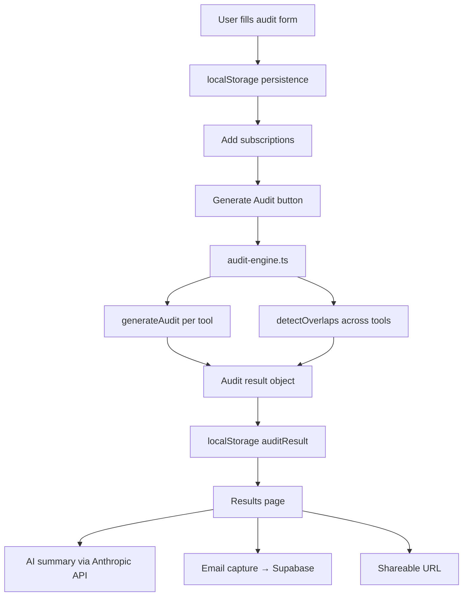

## System Diagram

## Data Flow
1. User inputs tool, plan, seats, team size, use case
2. Form auto-calculates spend from pricing.ts × seats
3. On "Add Subscription", entry saved to subscriptions array in localStorage
4. On "Generate Audit", audit-engine runs generateAudit() per subscription 
   and detectOverlaps() across all subscriptions
5. Combined result saved to localStorage as auditResult
6. Results page reads auditResult and renders savings breakdown
7. Anthropic API generates a personalized 100-word summary
8. Email captured and stored in Supabase

## Stack choices
- Next.js 16 — App router, SSR for OG tags, easy Vercel deploy
- TypeScript — Type safety on pricing data and audit logic
- Tailwind CSS — Fast styling, no custom CSS needed
- Vitest — Fast, works natively with TypeScript without extra config
- Supabase — Free tier, instant setup, no backend server needed

## Scaling to 10k audits/day
- Move audit results from localStorage to Supabase with a UUID per audit
- Add edge caching for the results page via Vercel Edge
- Rate limit the AI summary endpoint to avoid Anthropic API overuse
- Queue email sends via a background job instead of inline