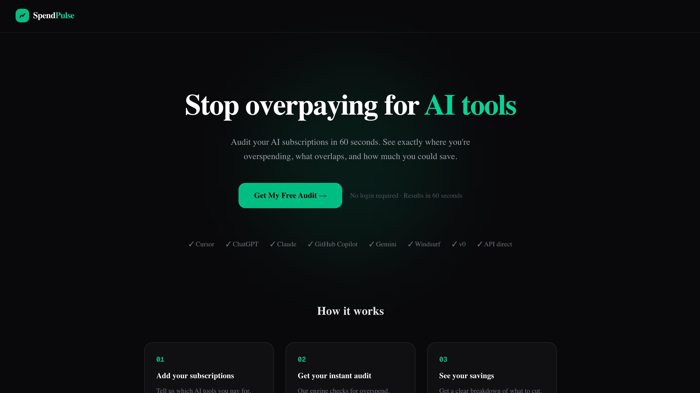
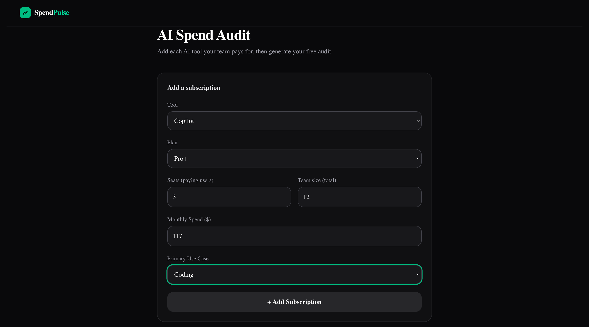
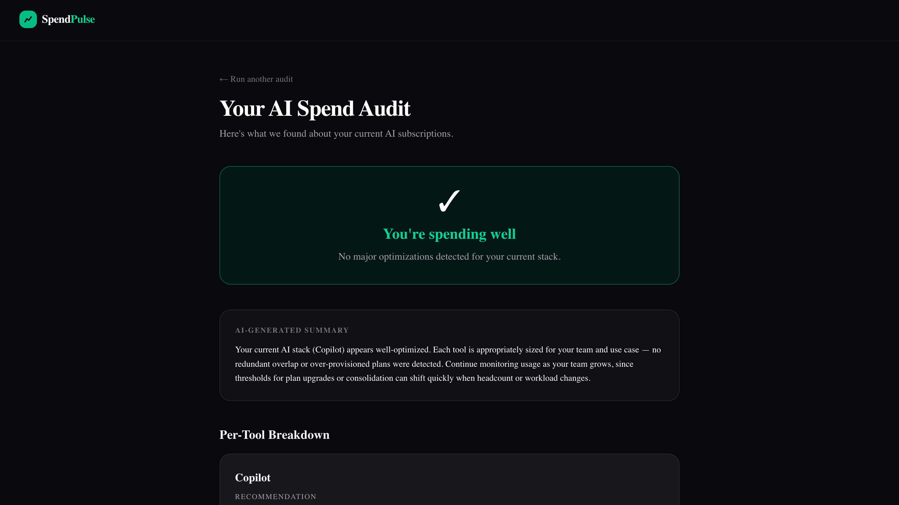

# SpendPulse — Free AI Spend Audit

SpendPulse helps startup founders and engineering managers find out
exactly where they're overspending on AI tools like Cursor, ChatGPT,
Claude, and GitHub Copilot — and what to do about it.

**[Live Demo →](https://spend-pulse.vercel.app/)**

---

## Screenshots






---

## Quick Start

```bash
git clone https://github.com/farzana-y/SpendPulse
cd ai-spend-audit
npm install
npm run dev
```

Open [http://localhost:3000](http://localhost:3000)

### Environment Variables

Create a `.env.local` file at the project root:

```env
NEXT_PUBLIC_SUPABASE_URL=your_supabase_url
NEXT_PUBLIC_SUPABASE_ANON_KEY=your_supabase_anon_key
NEXT_PUBLIC_BASE_URL=http://localhost:3000

# AI summary generation
GEMINI_API_KEY=your_gemini_key

# Transactional email (Resend)
RESEND_API_KEY=your_resend_api_key
```

#### Getting your Resend API key

1. Sign up at [resend.com](https://resend.com) — free tier includes 3,000 emails/month
2. Go to **API Keys** → **Create API Key** → copy it
3. Add it to `.env.local` as `RESEND_API_KEY`

> **Note on the sender address:** The default sender is `onboarding@resend.dev`, which works immediately on the free plan and sends to any recipient. To use a custom domain (e.g. `audit@yourdomain.com`), add and verify your domain in the Resend dashboard, then update the `from` field in `src/app/api/leads/route.ts`.

For production (Vercel), add all variables under **Project → Settings → Environment Variables**.

---

## Supabase Setup

Run the following in your Supabase SQL editor to create the required tables:

```sql
-- Stores lead capture submissions
create table leads (
  id uuid primary key default gen_random_uuid(),
  email text not null,
  company text,
  role text,
  total_monthly_savings numeric,
  tools text,
  created_at timestamptz default now()
);

-- Stores audit data for shareable URLs
create table audits (
  id uuid primary key,
  audits text,
  overlaps text,
  subscriptions text,
  total_monthly_savings numeric,
  tool_names text,
  created_at timestamptz default now()
);
```

---

## Decisions

1. **Next.js over plain React** — needed SSR for Open Graph tags on
   shareable audit URLs. Static React can't generate per-audit OG previews
   server-side.

2. **Hardcoded audit rules over AI** — the audit math uses deterministic
   rules, not an LLM. A finance person should be able to read the logic
   and agree with it. AI is only used for the summary paragraph where
   personalization matters and errors are low-stakes.

3. **localStorage over a database for audit state** — no login required
   was a hard requirement. localStorage lets the tool work instantly
   without any backend. The tradeoff is audits don't persist across
   devices, which is acceptable for an MVP.

4. **Vitest over Jest** — faster, works natively with TypeScript and
   Next.js without extra babel config. No meaningful tradeoff at this scale.

5. **Supabase over custom Postgres** — free tier, instant setup,
   built-in auth if needed later. The tradeoff is vendor lock-in,
   but for an MVP the speed advantage is worth it.